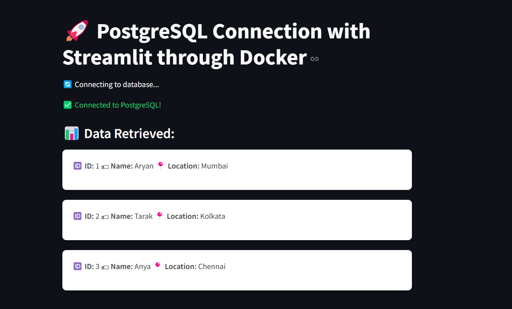
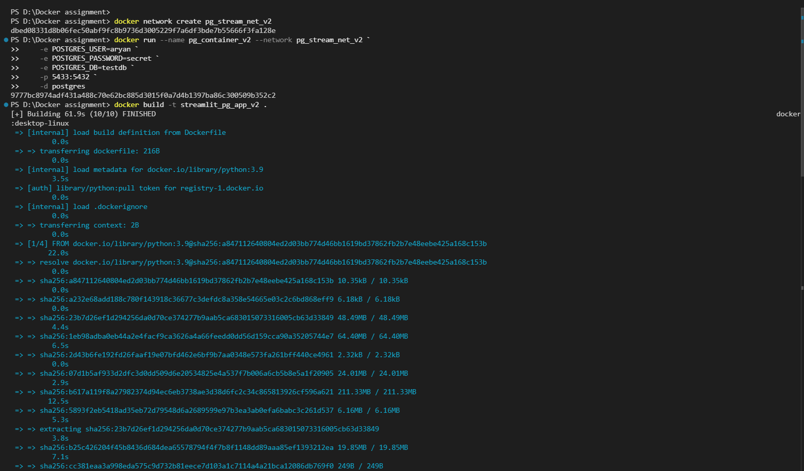
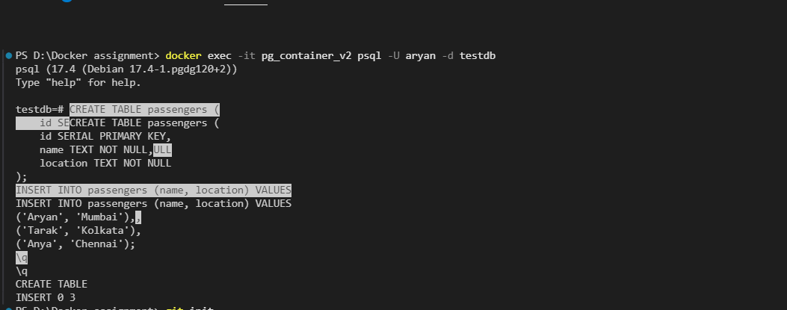

# 🚀 Deploying a Streamlit App with PostgreSQL in Docker

## 🌟 Overview

Ever wanted to seamlessly integrate a **Streamlit** web app with a **PostgreSQL** database, all within Docker? This guide will walk you through creating a fully containerized solution where your Streamlit app fetches and displays data from PostgreSQL. Let’s get started! 🐳

---

## 📂 Project Structure

```
Streamlit-Postgres-Docker/
│── Dockerfile
│── main.py
```

### 🔹 What’s Inside?

-   **`main.py`** → The Streamlit app that connects to PostgreSQL and fetches data dynamically.
-   **`Dockerfile`** → The blueprint for containerizing the Streamlit application.

---

## ALL the screen Shots






## 🏗 Setting Up PostgreSQL in Docker

### 1️⃣ Pull the PostgreSQL Docker Image

```sh
docker pull postgres
```

### 2️⃣ Create a Dedicated Docker Network

```sh
docker network create my_postgres_network
```

This ensures seamless communication between the PostgreSQL and Streamlit containers.

### 3️⃣ Launch the PostgreSQL Container

```sh
docker run --name my_postgres_container --network my_postgres_network \
    -e POSTGRES_USER=aryan -e POSTGRES_PASSWORD=secret -e POSTGRES_DB=testdb \
    -p 5432:5432 -d postgres
```

🚀 **What’s Happening?**

-   A PostgreSQL container is spun up with a custom **username, password, and database**.
-   The container is **connected to the custom Docker network**.
-   PostgreSQL is now accessible on port **5432**.

---

## 🛠 Creating & Populating the Database

### 4️⃣ Access PostgreSQL Inside the Container

```sh
docker exec -it my_postgres_container psql -U aryan -d testdb
```

### 5️⃣ Create a `passengers` Table

```sql
CREATE TABLE passengers (
    id SERIAL PRIMARY KEY,
    name VARCHAR(100),
    location VARCHAR(100)
);
```

### 6️⃣ Insert Sample Data

```sql
INSERT INTO passengers (name, location) VALUES
    ('Tarak', 'Pathankot'),
    ('Aryan', 'Jind'),
    ('Coach Saab', 'Atta');
```

✅ The database is now ready to be queried by the Streamlit app! 🎉

---

## 🎨 Building the Streamlit Application (`main.py`)

This script will:

-   Connect to **PostgreSQL** using `psycopg2`.
-   Fetch data dynamically from the `passengers` table.
-   Display results in a **beautifully styled** Streamlit interface.

```python
import streamlit as st
import psycopg2

# PostgreSQL Connection
conn = psycopg2.connect(
    dbname="testdb", user="aryan", password="secret", host="my_postgres_container"
)
cursor = conn.cursor()

# Query the database
cursor.execute("SELECT * FROM passengers;")
data = cursor.fetchall()

# Streamlit UI
st.title("🚆 Passenger Data Viewer")
st.write("### 👥 Passenger List from PostgreSQL Database")
st.table(data)
```

---

## 🐳 Dockerizing the Streamlit App

### 7️⃣ Create a `Dockerfile`

```dockerfile
FROM python:3.9
WORKDIR /app
COPY main.py .
RUN pip install streamlit psycopg2
CMD ["streamlit", "run", "main.py", "--server.port=8501", "--server.address=0.0.0.0"]
```

🚀 **What’s Happening?**

-   Uses **Python 3.9** as the base image.
-   Installs **Streamlit and psycopg2** for database interaction.
-   Runs the **Streamlit app** on port **8501**.

---

## 🎬 Running Everything with Docker

### 8️⃣ Build the Docker Image

```sh
docker build -t streamlit_app .
```

### 9️⃣ Run the Streamlit Container

```sh
docker run --name my_streamlit_container --network my_postgres_network -p 8501:8501 -d streamlit_app
```

✅ **What’s Happening?**

-   The Streamlit container is **connected to PostgreSQL** via `my_postgres_network`.
-   It runs on **port 8501**, making it accessible via a web browser.

---

## 🔗 Accessing the App

👉 Open your browser and go to **[http://localhost:8501](http://localhost:8501)** to see the Streamlit app displaying passenger data dynamically! 🎨

---

## 🎯 Summary

✅ **PostgreSQL container** stores and manages data.
✅ **Streamlit container** fetches and visualizes data from PostgreSQL.
✅ **Docker network** enables seamless container communication.
✅ **Application accessible at** [http://localhost:8501](http://localhost:8501).

🚀 This guide sets up a **fully containerized, database-powered web application** using **Streamlit and PostgreSQL** inside Docker. Happy coding! 🐳🔥
